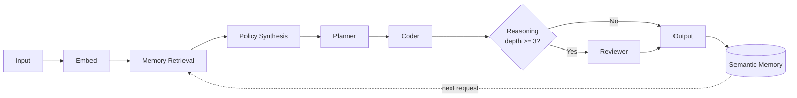

# opencode-ai-os-v4-semantic

An adaptive semantic AI execution engine for OpenCode that learns from past tasks and dynamically generates execution policy — **no hardcoded modes**.

## How It Works



Every request is embedded into a 128-dimension vector, compared against past task memories via cosine similarity, and used to synthesize a dynamic execution policy that controls pipeline depth, tool usage, and reasoning intensity.

## Core Design

- **NO Redis** — fully in-process
- **NO queue system** — synchronous pipeline
- **NO external APIs** — deterministic embedding via character distribution
- **NO FAST/DEEP/MCP modes** — policy is synthesized per-request

## Install

```bash
npm install opencode-ai-os-v4-semantic
```

## Usage (as an OpenCode plugin)

Add the plugin to your `opencode.json`:

```json
{
  "plugin": ["opencode-ai-os-v4-semantic"]
}
```

OpenCode will auto-load the plugin at startup. It hooks into `message.updated` events, runs the adaptive semantic engine on every user message, and injects the resulting policy + memory context into the session.

Results are also logged via OpenCode's structured logging system (visible with debug-level logging).

## Programmatic API

```ts
import {
  adaptiveEngine,
  embed,
  cosine,
  memoryStore,
} from "opencode-ai-os-v4-semantic";

// Run the full adaptive engine
const result = adaptiveEngine("Build a REST API for user profiles");
console.log(result.policy); // { steps: 3, toolUsage: "full", ... }
console.log(result.similarity); // 0.92 (if similar to past task)

// Check memory state
console.log(memoryStore.size); // number of stored memories
```

## Policy Object

```ts
interface ExecutionPolicy {
  steps: number;          // 1-5 execution steps
  toolUsage: "none" | "light" | "full";
  reasoningDepth: number; // 1-10
  asyncLevel: number;     // 1-5
}
```

## File Structure

```
src/
  index.ts      — Plugin entry, hooks into OpenCode events
  engine.ts     — Adaptive engine orchestrator
  embed.ts      — Deterministic embedding (128-dim)
  similarity.ts — Cosine similarity computation
  memory.ts     — In-memory semantic vector store
  policy.ts     — Policy synthesizer (replaces hardcoded modes)
  exec.ts       — Planner, coder, reviewer pipeline
```

## License

MIT
